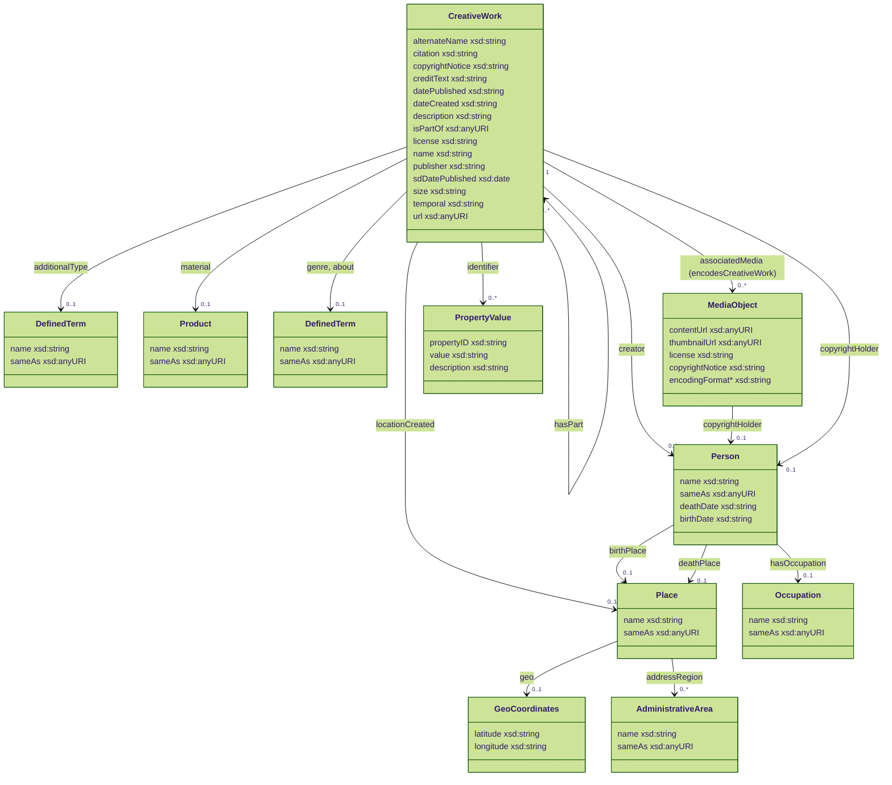

# Applicatieprofiel voor CollectieNederland.nl

## Inleiding

In deze documentatie wordt het applicatieprofiel beschreven voor CollectieNederland.nl. Dit profiel is gebaseerd op het [<u>nieuwe datamodel voor Collectienederland.nl</u>](https://github.com/collectienederland/schema-profile), dat schema.org gebruikt als beschrijvende vocabulaire. Dit model is weer een uitbreiding op het [<u>NDE-applicatieprofiel</u>](https://docs.nde.nl/schema-profile/) ([versie 1.4.0](https://docs.nde.nl/schema-profile/#v1.4.0)) en volgt dit applicatieprofiel grotendeels. Dit document vormt de basis voor de aanlevervoorwaarden van CollectieNederland.nl

Op enkele punten wijkt het applicatieprofiel voor CollectieNederland.nl af van het NDE-applicatieprofiel. Het gaat hier altijd om versoepelingen en aanvullingen ten op zichten van het NDE-applicatieprofiel, nooit om striktere eisen. Deze punten zijn terug te vinden onder 1.2.5.

De velden die minimaal nodig zijn om data aan te leveren aan CollectieNederland.nl staan genoteerd onder 1.2. De thesauri die CollectieNederland.nl aanhoudt zijn terug te vinden onder sectie 1.5.

### Definities

**Kardinaliteit**: hoe vaak een waarde mag voorkomen in een veld.
Hierbinnen geeft dit document ook de specifieke datatypes aan (bijv. URI
of Date) of de thesauri die toegestaan zijn.

- 0..\* de waarde mag nul, één of meerdere keren voorkomen

- 1..\* de waarde moet minimaal 1 keer voorkomen en mag meerdere malen
  voorkomen

- 0..1 de waarde mag 0 of 1 keer voorkomen

- 1..1 de waarde moet één keer voorkomen

**Classes**: Een type entiteit in schema.org (bijv. Place of
CreativeWork). Deze worden gebruikt om te bepalen welke entiteiten
toegestaan zijn in het applicatieprofiel.

**Properties**: de kenmerken die binnen een Class vallen (bijv.
schema:name en schema:description).). Deze worden gebruikt om te bepalen
welke entiteiten toegestaan zijn in het applicatieprofiel.

**Verplichtingsniveau:**

- **Verplicht**: de waarden die altijd moeten worden aangeleverd
  (schema:license)

- **Sterk aanbevolen**: de waarden waarvan sterk wordt aanbevolen dat ze
  worden aangeleverd

- **Aanbevolen**: de waarden waarvan wordt aanbevolen dat ze worden
  aangeleverd

- **Optioneel:** de waarden die mogen worden aangeleverd
  (schema:material)

### Velden voor CollectieNederland.nl

CollectieNederland.nl is een Nederlands dienstplatform en toont de collectiedata in het Nederlands. Zorg dat de velden een ‘nl’ of ‘nl-NL’ tag hebben waarin de taal van de data wordt aangegeven.

### Minimale en sterk aanbevolen  velden

Bij het aanleveren van collectiedata aan CollectieNederland.nl wordt gekeken of de volgende minimale en sterk aanbevolen velden aanwezig zijn in de data en of de inhoud van deze velden in lijn is met het NDE-applicatieprofiel en de aanvullende bepalingen ten behoeve van CollectieNederland.nl. Als er voor een  veld een afwijking of versoepeling geldt, dan is deze leidend ten opzichte van het
NDE-applicatieprofiel. Bij overlap tussen de twee profielen verwijst dit
document door naar het NDE-applicatieprofiel.

### Overzichtstabel minimale en sterk aanbevolen velden

In de onderstaande tabel staat een overzicht van de minimale (ofwel
verplichte) en sterk aanbevolen velden voor publicatie van een dataset
op CollectieNederland.nl. Er zijn een aantal ‘keuzevelden’ opgenomen.
Voor deze velden geldt:

\- Keuzeveld 1: er moet ten minste één veld aanwezig zijn wat kan
functioneren als titel.

\- Keuzeveld 2: er wordt sterk aanbevolen ten minste één veld aan te
leveren wat kan functioneren als datering.

\- Keuzeveld 3: er wordt sterk aanbevolen ten minste één veld aan te
leveren dat iets beschrijft van en/of over het object (CreativeWork).

| *Entiteit* | *Veld* | *Betekenis* | *Verplicht* | *Type* |
|----|----|----|----|----|
| MediaObject | Schema:license | Rechtenstatement afbeelding | Ja, als schema:contentUrl aanwezig is | URI |
| CreativeWork | schema:copyrightNotice | Actuele juridische status | Ja, voor Rijksmusea | URI |
| CreativeWork | Schema:isPartOf\>schema:Dataset | Beschrijft van welke dataset het object deel uitmaakt | Ja | URI |
| CreativeWork | schema:sdDatePublished | Datum van publicatie metadata | Ja | date |
| CreativeWork | schema:name | Titel | Keuzeveld 1 – schema:name of schema:additionalType | String |
| CreativeWork | schema:additionalType | Soort object | Keuzeveld 1 - schema:name of schema:additionalType | String of URI |
| CreativeWork | schema:temporal | Periode van vervaardiging | Keuzeveld 2 – sterk aanbevolen | String |
| CreativeWork | schema:dateCreated | Vervaardigingsdatum | Keuzeveld 2 – sterk aanbevolen | Date |
| CreativeWork | schema:description | Beschrijving van het object | Keuzeveld 3 – sterk aanbevolen | String |
| CreativeWork | schema:material | Materiaal | Keuzeveld 3 – sterk aanbevolen | String/URI |
| CreativeWork | schema:size | Afmetingen | Keuzeveld 3 – sterk aanbevolen | String/QuantitativeValue |
| CreativeWork | schema:locationCreated | Plaats van productie of vervaardiging | Keuzeveld 3 – sterk aanbevolen | String/URI |

### Aanbevolen en optionele velden

In de onderstaande tabel staat een overzicht van de velden die worden aanbevolen of optioneel zijn om aan te leveren. In sectie 1.3 worden de velden toegelicht. In sommige gevallen is het zo dat als een optioneel veld wordt aangeleverd, er een verplicht veld bijkomt – dat aan het optionele veld verbonden is. Mocht dit zo zijn dan staat dit per veld aangegeven in de kolom optioneel/aanbevolen.

### Overzichtstabel aanbevolen en optionele velden

| **Entiteit** | **Veld** | **Inhoud van het veld** | **Verplicht** | **Type** | **NDE-profiel** |
|----|----|----|----|----|----|
| Schema:CreativeWork | schema:alternateName | alternatieve titel van het object | Optioneel | String | Nee, uitbreiding CN.nl |
| Schema:Creative:Work | Schema:license | Rechtenstatement van het object zelf | Aanbevolen | URI | Nee, uitbreiding CN.nl |
| Schema:CreativeWork | Schema:url | Link van het object op de website van de bronhouder | Aanbevolen | URI | Nee, uitbreiding CN.nl |
| Schema:CreativeWork | schema:creditText | geassocieerde persoon of organisatie | Optioneel | String/URI | Nee, uitbreiding CN.nl |
| Schema:CreativeWork | schema:publisher | Uitgever object | Optioneel | String | Nee, uitbreiding CN.nl |
| Schema:CreativeWork | schema:datePublished | datum van uitgave door uitgever | Optioneel | Date | Nee, uitbreiding CN.nl |
| Schema:CreativeWork | schema:citation | Referentie naar uitgave of bron | Optioneel | String | Nee, uitbreiding CN.nl |
| Schema:CreativeWork | schema:temporal | Tijdsaanduiding in platte tekst | Optioneel | String | Nee, uitbreiding CN.nl |
| Schema:CreativeWork | schema:isPartOf/hasPart \>CreativeWork | Deelcollectie | Aanbevolen | URI | Nee, uitbreiding CN.nl |
| Schema:CreativeWork | schema:genre | Onderwerp | Aanbevolen | String/URI | Ja |
| Schema:CreativeWork | schema:about | Geassocieerde persoon of concept | Aanbevolen | String/URI | Ja |
| Schema:CreativeWork | schema:identifier | Objectnummer | Aanbevolen | String/URI | Ja |
| Schema:CreativeWork | schema:creator | Vervaardiger | Aanbevolen | String/URI | Ja |
| Schema:MediaObject | schema:contentUrl | Afbeelding | Aanbevolen | URI | Ja |
| Schema:MediaObject | schema:license | Rechtenstatement afbeelding | Ja, bij schema:contentUrl | URI | Ja |
| Schema:MediaObject | Schema:copyrightHolder | Rechthebbenden van een MediaObject | Optioneel | Schema:Person | ja |
| Schema:MediaObject | schema:thumbnailUrl | Verkleinde afbeelding | Verplicht met contentUrl | URI | Ja |
| Schema:Person | schema:name | Vervaardiger persoon of organisatie | Aanbevolen | String/URI | Ja |
| Schema:Person | schema:hasOccupation | Rol van de vervaardiger | Optioneel | String/URI | Ja |
| Schema:Person | schema:birthDate | Geboortedatum vervaardiger | Optioneel | Date | Ja |
| Schema:Person | schema:birthPlace | Geboorteplaats vervaardiger | Optioneel | String/URI | Ja |
| Schema:Person | schema:deathDate | Sterfdatum vervaardiger | Optioneel | Date | Ja |
| Schema:Person | schema: deathPlace | Sterfplaats vervaardiger | Optioneel | String/URI | Ja |
| Schema:Place | schema:latitude | Breedtegraad | Optioneel | Tekst | Ja |
| Schema:Place | schema:longitude | Lengtegraad | Optioneel | Tekst | Ja |
| Schema:Place | schema:addressRegion | Provincie | Optioneel | String/URI | Ja |
| Schema:MediaObject | schema:encodingFormat | Type media | Optioneel | String/URI | Nee, uitbreiding CN.nl |

### Afwijkingen ten opzichte van het NDE applicatieprofiel

In de onderstaande tabellen zijn de verschillen terug te vinden tussen hetCollectieNederland.nl-applicatieprofiel en het NDE-applicatieprofiel. Het gaat hier in de eerste tabel om verschillen in de aanwezigheid van Classes en Properties. In de tweede tabel worden de verschillen aangegeven in Classes en Properties die zowel het NDE-applicatieprofiel als CollectieNederland.nl-applicatieprofiel kennen, maar waarbij CollectieNederland.nl een ander verplichtingsniveau hanteert (bijv. optioneel i.p.v. verplicht) of een andere invulling geeft.

<table>
<colgroup>
<col style="width: 41%" />
<col style="width: 9%" />
<col style="width: 22%" />
<col style="width: 26%" />
</colgroup>
<thead>
<tr>
<th colspan="4"><strong>CollectieNederland.nl ten opzichte van NDE —
toevoegingen</strong> <strong>in Classes en Properties</strong></th>
</tr>
</thead>
<tbody>
<tr>
<td><strong>Property/Class</strong></td>
<td><strong>In NDE profiel</strong></td>
<td><strong>In CN.NL 2.0 Datamodel en applicatieprofiel</strong></td>
<td><strong>Uitleg op toevoeging</strong></td>
</tr>
<tr>
<td>CreativeWork&gt;schema:publisher</td>
<td>Nee</td>
<td>Ja — optioneel</td>
<td>Uitgever van een boek. Publisher, ofwel, bronhouder komt mee vanuit
de datasetbeschrijving van de dataset in het dataset register.</td>
</tr>
<tr>
<td>CreativeWork&gt;schema:license</td>
<td>Nee</td>
<td>Ja — aanbevolen</td>
<td>Rechtenstatement van het object zelf</td>
</tr>
<tr>
<td>CreativeWork&gt;schema:temporal</td>
<td>Nee</td>
<td>Ja — keuzeveld 2</td>
<td>Vrije-tekst datering (bijv. “ca. 1650”) als aanvulling op
schema:dateCreated, voor onzekere of ongestructureerde dateringen.</td>
</tr>
<tr>
<td>MediaObject&gt;schema:copyrightNotice</td>
<td>Nee</td>
<td>Ja — verplicht (alleen Rijksmusea)</td>
<td>Toevoeging voor de Erfgoedwet-verplichtingen van Rijksmusea.</td>
</tr>
<tr>
<td>Place&gt;schema:addressRegion</td>
<td>Nee</td>
<td>Ja — optioneel</td>
<td>Coördinaten en provincie/regio, voor kaartweergave en filtering op
CNNL.</td>
</tr>
<tr>
<td>CreativeWork&gt;schema:isPartOf (hasPart)&gt;CreativeWork</td>
<td>Nee</td>
<td>Ja - aanbevolen</td>
<td>Relatie voor het aangeven van een deelcollectie binnen een
dataset.</td>
</tr>
<tr>
<td>CreativeWork&gt;schema:alternateName</td>
<td>Nee</td>
<td>Ja — optioneel</td>
<td>Alternatieve naam/titel van object of
vervaardiger.<mark></mark></td>
</tr>
<tr>
<td>CreativeWork&gt;schema:creditText</td>
<td>Nee</td>
<td>Ja — optioneel</td>
<td>Generieke attributie-/credittekst. Let op: voor het specifieke geval
van eigendomsgeschiedenis wordt dit veld juist afgeraden (te weinig
gestructureerd) — hier gaat het om een breder, algemeen gebruik.</td>
</tr>
<tr>
<td>CreativeWork&gt;schema:citation</td>
<td>Nee</td>
<td>Ja — optioneel</td>
<td>Verwijzing naar publicaties of bronnen waarin het object wordt
beschreven.</td>
</tr>
<tr>
<td>CreativeWork&gt;schema:datePublished</td>
<td>Nee</td>
<td>Ja — optioneel</td>
<td>Datum van publicatie, bijvoorbeeld van een boek.<mark></mark></td>
</tr>
<tr>
<td>MediaObject&gt;schema:encodingFormat</td>
<td>Nee</td>
<td>Ja — optioneel</td>
<td>Type media</td>
</tr>
<tr>
<td>schema:AdministrativeArea</td>
<td>Nee</td>
<td>Ja – optioneel</td>
<td>De provincie waarin de plek (Schema:Place) zich bevindt.</td>
</tr>
</tbody>
</table>

<table>
<colgroup>
<col style="width: 24%" />
<col style="width: 16%" />
<col style="width: 58%" />
</colgroup>
<thead>
<tr>
<th colspan="3"><strong>CollectieNederland.nl ten opzichte van NDE —
afwijkend verplichtingsniveau</strong></th>
</tr>
</thead>
<tbody>
<tr>
<td><strong>Property</strong></td>
<td><strong>NDE</strong></td>
<td><strong>CN</strong></td>
</tr>
<tr>
<td>CreativeWork&gt;schema:creator</td>
<td>Verplicht als de vervaardiger bekend is.</td>
<td>Aanbevolen</td>
</tr>
<tr>
<td>MediaObject&gt;schema:thumbnailUrl</td>
<td>Verplicht op MediaObject.</td>
<td></td>
</tr>
<tr>
<td>CreativeWork&gt;schema:associatedMedia / afbeelding</td>
<td>Verplicht indien beschikbaar.</td>
<td>Aanbevolen</td>
</tr>
<tr>
<td>CreativeWork&gt;schema:identifier / PID</td>
<td>PID verplicht.</td>
<td>Aanbevolen</td>
</tr>
<tr>
<td>CreativeWork&gt;schema:name</td>
<td>Verplicht op CreativeWork</td>
<td>Aanbevolen. CollectieNederland.nl vraagt schema:name of
schema:additionalType, zie sectie 1.2.2.</td>
</tr>
</tbody>
</table>

### Thesauri-gebruik

Wanneer er gebruikt gemaakt wordt van thesaurustermen dan worden de volgende thesauri aangenomen, afhankelijk van metadata veld: Art & Architecture Thesaurus (AAT), Cultuurhistorische Thesaurus (CHT), GeoNames en RKDartists. Al deze thesauri zijn te raadplegen via het [Termennetwerk](https://termennetwerk.netwerkdigitaalerfgoed.nl/nl). Bekijk hier een omschrijving van thesaurustermen in het NDE-applicatieprofiel: [<u>https://docs.nde.nl/schema-profile/#reference-terms.</u>](https://docs.nde.nl/schema-profile/#reference-terms.)

## CollectieNederland.nl-applicatieprofiel 

Afwijkingen van het NDE-applicatieprofiel zijn gemarkeerd door middel van een asterisk (\*) en zijn met uitleg terug te vinden in de bovenstaande sectie 1.2.5.

### Klassediagram

Hieronder is een overzicht van het datamodel te zien. Als centrale klasse word [CreativeWork](https://schema.org/CreativeWork) gebruikt.

<!--<pre class="mermaid">-->

<!--</pre>-->

### [CreativeWork](https://schema.org/CreativeWork)
De centrale klasse in het CollectieNederland.nl-applicatieprofiel. Met deze klasse worden cultuurhistorische objecten omschreven in dit profiel.

#### [schema:name](https://schema.org/name)
<i>Verplicht, tenzij [schema:additionalType](https://schema.org/additionalType) aanwezig is. </i>
- <b>Beschrijving:</b> titel van het object
- <b>Datatype:</b> string
- <b>Kardinaliteit:</b> 0..1
- <b>Voorbeeld:</b> Zie [documentatie van het NDE](https://docs.nde.nl/schema-profile/#CreativeWork-name) voor meer informatie en voorbeelden.

#### [schema:additionalType](https://schema.org/additionalType)
<i>Verplicht, tenzij [schema:name](https://schema.org/name) aanwezig is. </i>
- <b>Beschrijving:</b> Specifiek type van het werk (bijv. schilderij).
- <b>Datatype:</b> string
- <b>Kardinaliteit:</b> 0..1
- <b>Voorbeeld:</b> 
```
{
  "@context": "https://schema.org",
  "@type": "CreativeWork",
  "additionalType": {
    "@type": "DefinedTerm",
    "name": "schilderij",
    "sameAs": "..."
  }
}
```

#### [schema:alternateName](https://schema.org/alternateName)
<i>Optioneel</i><br/><br/>
- <b>Beschrijving:</b> alternatieve titel van het object
- <b>Datatype:</b> string
- <b>Kardinaliteit:</b> 0..1

Uitbreiding NDE-applicatieprofiel om musea de mogelijkheid te geven om objecten meerdere titels mee te geven zoals toegekende titel of originele titel.

- <b>Voorbeeld:</b> 
``` 
{
  "@context": "https://schema.org",
  "@type": "CreativeWork",
  "name": "De Schreeuw"@nl,
  "alternateName": "Skrik"@no,
}
```

#### [schema:copyrightNotice](https://schema.org/copyrightNotice)
<i>Verplicht voor Rijksmusea</i>
- <b>Beschrijving:</b> Actuele juridische status (Rijksmusea, Erfgoedwet)
- <b>Waarde:</b> *Waarde moet nog bepaald worden*

#### [schema:isPartOf](https://schema.org/isPartOf) (Dataset)
<i>Verplicht</i>
- <b>Beschrijving:</b> Dataset waartoe het werk behoort
- <b>Waarde:</b> zie [documentatie van het NDE](https://docs.nde.nl/schema-profile/#CreativeWork-isPartOf)
- <b>Datatype:</b> URI
- <b>Kardinaliteit:</b> 1..1
- <b>Voorbeeld:</b> 
``` 
{
  "@context": "https://schema.org",
  "@type": "CreativeWork",
  "isPartOf": "https://linkeddata.cultureelerfgoed.nl/rce/datacatalog/id/dataset/db6193aa-84af-3edf-90fd-074a0a11248d"
}
```

#### [schema:hasPart](https://schema.org/hasPart) (Deelcollectie)
<i>Optioneel</i><br/><br/>
- <b>Beschrijving:</b> Onderdeel van deelcollectie.
- <b>Datatype:</b> URI
- <b>Kardinaliteit:</b> 0..*
- <b>Voorbeeld:</b> 
``` 
{
  "@context": "https://schema.org",
  "@type": "CreativeWork",
  "hasPart": "https://linkeddata.cultureelerfgoed.nl/rce/rijkscollectie-rce/id/creativework/74c80173-b77c-3799-afbd-72a13f31fd58",
}
```

#### [schema:publisher](https://schema.org/publisher) 
<i>Optioneel</i><br/><br/>
- <b>Beschrijving:</b> uitgever van een boek, tijdschrift of artikel. Uitbreiding op het NDE-applicatieprofiel voor museumcollecties die
      ook boeken, artikelen of andere objecten hebben in de
      museumcollectie.
- <b>Datatype:</b> string
- <b>Voorbeeld:</b> 
```
Uitgeverij Noordzon
```


#### [schema:temporal](https://schema.org/temporal)
<i>Optioneel</i><br/><br/>
<i>Toevoeging op het NDE-applicatieprofiel, vanwege collecties diegeen datering hebben, maar uit een bepaalde periode komen zoals archeologische opgravingen.</i>
- <b>Beschrijving:</b> onzekerheidsaanduiding datering als vrije tekst, bijvoorbeeld:
  - Ca.
  - Circa
  - Ongeveer
- <b>Datatype:</b> string
- <b>Kardinaliteit:</b> 0..1

#### [schema:datePublished](https://schema.org/datePublished)
<i>Optioneel</i><br/><br/>
<i>Uitbreiding op het NDE-applicatieprofiel voor museumcollecties die ook boeken, artikelen of andere objecten hebben in de museumcollectie.</i>

- <b>Beschrijving:</b> datum waarop het object is uitgegeven door de uitgever.
- <b>Datatype:</b> date, conform ISO-8601

#### [schema:sdDatePublished](https://schema.org/sdDatePublished)
<i>Verplicht</i><br/><br/>
- <b>Beschrijving:</b> de datum waarop de metadata is gepubliceerd, zie https://docs.nde.nl/schema-profile/#CreativeWork-sdDatePublished.
- <b>Datatype:</b> date, conform ISO-8601

#### [schema:citation](https://schema.org/citation)
<i>Optioneel</i><br/><br/> 
<i>Uitbreiding op het NDE-applicatieprofiel voor verwijzingen naar publicaties of boeken die aan een object gerelateerd zijn.
</i><br/>
- <b>Beschrijving:</b> referentie naar een publicatie of boek.
- <b>Datatype:</b> string
- <b>Voorbeeld:</b> 
```
van den Boorn, G.P.F. and Van Es, M.J. (1989), Recent Acquisitions: II. The Near East. OMROL 69, blz. 13
```

#### [schema:url](https://schema.org/url)
<i>Optioneel</i><br/><br/> 
- <b>Beschrijving:</b> Link terug naar het record bij de bronhouder, zie <https://docs.nde.nl/schema-profile/#CreativeWork-URI>.
- <b>Datatype:</b> URI
- <b>Kardinaliteit:</b> 0..1
- <b>Voorbeeld:</b>
```
http://hdl.handle.net/10934/RM0001.COLLECT.250239
https://muiderslot.adlibhosting.com/details/museum/10000349
```

#### [schema:license](https://schema.org/license)

<i>Optioneel</i><br/><br/> 
- <b>Beschrijving</b>: rechtenstatement van het object zelf (URI). Uitsluitend rechtenstatements van Rightstatements.org.
- <b>Datatype:</b> URI
- <b>Kardinaliteit:</b> 0..1
- <b>Voorbeeld:</b> http://rightsstatements.org/vocab/InC/1.0/

#### [schema:description](https://schema.org/description)

<i>Optioneel</i><br/><br/>

#### [schema:creditText](https://schema.org/creditText)

<i>Optioneel</i><br/><br/> 
<i>Uitbreiding NDE-applicatieprofiel voor generieke attributie-/credittekst. Let op: voor het specifieke geval eigendomsgeschiedenis is dit veld juist afgeraden (te weinig gestructureerd) — hier gaat het om een breder, algemeen gebruik.</i><br/><br/> 

- <b>Beschrijving:</b> geassocieerde persoon of organisatie die is gerelateerd  aan het object.
- <b>Datatype:</b> string
- <b>Kardinaliteit:</b> 0..1

Uitbreiding NDE-applicatieprofiel voor generieke attributie-/credittekst. Let op: voor het specifieke geval eigendomsgeschiedenis is dit veld juist afgeraden (te weinig gestructureerd) — hier gaat het om een breder, algemeen gebruik.

- <b>Voorbeeld:</b> 
``` 
{
  "@context": "https://schema.org",
  "@type": "CreativeWork",
  "creditText": "In bruikleen van Fam. de Wit."@nl,
}
```

#### [schema:creator](https://schema.org/creator)
<i>Verplicht</i><br/><br/> 
- <b>Beschrijving</b>: Maker van het werk, zie ook [documentatie van het NDE](https://docs.nde.nl/schema-profile/#CreativeWork-creator).
- <b>Datatype:</b> [Person](#person).
- <b>Kardinaliteit:</b> 1..1

<hr/>

### [Person](https://schema.org/Person)
<a name="person"></a>

#### [schema:name](https://schema.org/name)
<i>Verplicht</i><br/><br/> 
- <b>Beschrijving:</b>  Naam van de persoon of organisatie
- <b>Datatype:</b> string
- <b>Kardinaliteit:</b> 1..1
- <b>Voorbeeld:</b> Zie [documentatie van het NDE](https://docs.nde.nl/schema-profile/#CreativeWork-name) voor meer informatie en voorbeelden.

#### [schema:sameAs](https://schema.org/sameAs)
<i>Optioneel</i><br/><br/> 
- <b>Beschrijving:</b>  Rechtenstatement van de afbeelding, verplicht als URI.
- <b>Datatype:</b> URI
- <b>Kardinaliteit:</b> 0..1

#### [schema:deathDate](https://schema.org/license)
<i>Optioneel</i><br/><br/> 
- <b>Beschrijving:</b>  
- <b>Datatype:</b> date
- <b>Kardinaliteit:</b> 0..1

#### [schema:birthDate](https://schema.org/license)
<i>Optioneel</i><br/><br/> 
- <b>Beschrijving:</b>  
- <b>Datatype:</b> date
- <b>Kardinaliteit:</b> 0..1

#### [schema:birthPlace](https://schema.org/birthPlace)
<i>Optioneel</i><br/><br/> 
- <b>Beschrijving:</b>  -- 
- <b>Datatype:</b> [Place](#Place). 
- <b>Kardinaliteit:</b> 0..1

#### [schema:occupation](https://schema.org/occupation)
<i>Optioneel</i><br/><br/> 
- <b>Beschrijving:</b> 
- <b>Datatype:</b> [Occupation](#Occupation). 
- <b>Kardinaliteit:</b> 0..1

<hr/>

### [MediaObject](https://schema.org/MediaObject)
<a name="MediaObject"></a>

#### [schema:contentUrl](https://schema.org/contentUrl)
<i>Verplicht</i><br/><br/> 
- <b>Beschrijving:</b>  Directe URI naar het mediabestand, verplicht als geldige URI. <https://docs.nde.nl/schema-profile/#MediaObject-contentUrl>
- <b>Datatype:</b>  URI 
- <b>Kardinaliteit:</b> 1..1

#### [schema:thumbnailUrl](https://schema.org/thumbnailUrl)
<i>Verplicht</i><br/><br/> 
- <b>Beschrijving:</b>  Directe URI naar de thumbnail, verplicht als geldige URI. <https://docs.nde.nl/schema-profile/#MediaObject-thumbnailUrl>
- <b>Datatype:</b>  URI 
- <b>Kardinaliteit:</b> 1..1

#### [schema:license](https://schema.org/license)
<i>Verplicht</i><br/><br/> 
- <b>Beschrijving:</b>  Rechtenstatement van de afbeelding, verplicht als URI.
- <b>Datatype:</b>  URI 
- <b>Kardinaliteit:</b> 1..1

#### [schema:encodingFormat](https://schema.org/encodingFormat)
<i>Optioneel</i><br/><br/> 
- <b>Beschrijving:</b>  
- <b>Datatype: string</b> 
- <b>Kardinaliteit:</b> 0..1
- <b>Voorbeeld:</b> 
```
{
  "@context": "https://schema.org",
  "@type": "MediaObject",
  "encodingformat": "image/jpeg"
}
```

#### [schema:copyrightHolder](https://schema.org/copyrightHolder)
<i>Optioneel</i><br/><br/> 
- <b>Beschrijving:</b>  Rechthebbende van het mediaobject.
- <b>Datatype:</b>  [Person](#person).
- <b>Kardinaliteit:</b> 0..1

#### [schema:copyrightNotice](https://schema.org/copyrightNotice)
<i>Optioneel</i><br/><br/> 
- <b>Beschrijving:</b>  Rechtenstatement van de afbeelding, als tekst beschreven.
- <b>Datatype:</b>  string
- <b>Kardinaliteit:</b> 0..1

<hr/>

### [Place](https://schema.org/Place)
<a name="Place"></a>

<hr/>

### [AdministrativeArea](https://schema.org/AdministrativeArea)
<a name="AdministrativeArea"></a>

<hr/>

### [Place](https://schema.org/Place)
<a name="Place"></a>

<hr/>

### [Occupation](https://schema.org/Occupation)
<a name="Occupation"></a>


#### [schema:name](https://schema.org/name)
<i>Verplicht</i><br/><br/> 
- <b>Beschrijving:</b>  
- <b>Datatype:</b>  string
- <b>Kardinaliteit:</b> 1..1

#### [schema:sameAs](https://schema.org/sameAs)
<i>Optioneel</i><br/><br/> 
- <b>Beschrijving:</b>  
- <b>Datatype:</b>  URI
- <b>Kardinaliteit:</b> 0..1
- <b>Voorbeeld:</b> 

```
{
  "@context": "https://schema.org",
  "@type": ["Occupation"],
  "name": "Fotograaf",
  "sameAs": "https://data.cultureelerfgoed.nl/term/id/cht/fa108e11-e409-4a69-938e-1c1e66927c13",
}
```

<hr/>

### [PropertyValue](https://schema.org/PropertyValue)
<a name="PropertyValue"></a>

#### [schema:propertyID](https://schema.org/propertyID)
<i>Verplicht</i><br/><br/> 
- <b>Beschrijving:</b>  
- <b>Datatype:</b>  string
- <b>Kardinaliteit:</b> 1..1

#### [schema:value](https://schema.org/value)
<i>Verplicht</i><br/><br/> 
- <b>Beschrijving:</b>  
- <b>Datatype:</b>  string
- <b>Kardinaliteit:</b> 1..1

#### [schema:description](https://schema.org/description)
<i>Optioneel</i><br/><br/> 
- <b>Beschrijving:</b>  
- <b>Datatype:</b>  string
- <b>Kardinaliteit:</b> 1..1

<hr/>

### [DefinedTerm](https://schema.org/DefinedTerm)
<a name="DefinedTerm"></a>

#### [schema:name](https://schema.org/name)
<i>Verplicht</i><br/><br/> 
- <b>Beschrijving:</b>  
- <b>Datatype:</b>  string
- <b>Kardinaliteit:</b> 1..1

#### [schema:sameAs](https://schema.org/sameAs)
<i>Optioneel</i><br/><br/> 
- <b>Beschrijving:</b>  
- <b>Datatype:</b>  URI
- <b>Kardinaliteit:</b> 0..1
<hr/>

### [Product](https://schema.org/Product)
<a name="Product"></a>

#### [schema:name](https://schema.org/name)
<i>Verplicht</i><br/><br/> 
- <b>Beschrijving:</b>  
- <b>Datatype:</b>  string
- <b>Kardinaliteit:</b> 1..1

#### [schema:sameAs](https://schema.org/sameAs)
<i>Optioneel</i><br/><br/> 
- <b>Beschrijving:</b>  
- <b>Datatype:</b>  URI
- <b>Kardinaliteit:</b> 0..1
- <b>Voorbeeld:</b> 

```
{
  "@context": "https://schema.org",
  "@type": ["Product"],
  "name": "Fotograaf",
  "sameAs": "https://data.cultureelerfgoed.nl/term/id/cht/152a6b74-0549-4e53-aec0-f8209db88b86",
}
```
<hr/>
<!--
<script type="module">
	import mermaid from 'https://cdn.jsdelivr.net/npm/mermaid@10/dist/mermaid.esm.min.mjs';
	mermaid.initialize({
		startOnLoad: true,
		theme: 'dark'
	});
</script>
-->